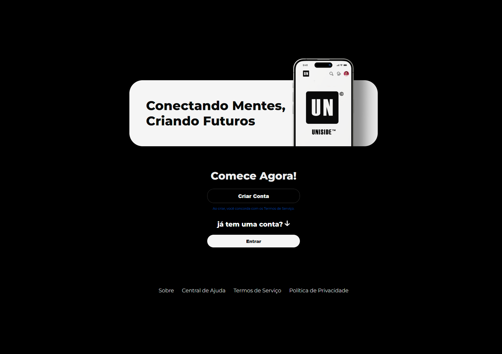

# tela-de-login-estilo-apple-x
O projeto adota uma abordagem de design minimalista e elegante, incorporando elementos visuais inspirados nos estilos de login da Apple e Twitter.

# Tela de Login Moderna

Este repositório contém uma implementação de uma tela de login moderna, inspirada nos estilos de login da Apple e Twitter. A tela de login é projetada para ser elegante, funcional e pronta para se conectar ao back-end de sua aplicação.

## Recursos Principais

- **Design Moderno**: O projeto adota um design minimalista e contemporâneo, incorporando elementos visuais inspirados nas interfaces de login da Apple e Twitter.

- **Conexão com o Back-End**: A tela de login está pronta para integração com o back-end de sua aplicação, permitindo autenticação de usuários de maneira segura.

- **Usabilidade Aprimorada**: A interface do usuário é intuitiva e oferece uma experiência de login eficiente.

- **Personalização Fácil**: O código é altamente personalizável, permitindo que você adapte a tela de login às necessidades específicas de seu projeto.

## Contato

Se você tiver alguma dúvida ou precisar de suporte, entre em contato conosco em caue.frontdev@gmail.com (mailto:caue.frontdev@gmail.com).

---

Este projeto é desenvolvido e mantido por Cauê Felipe (https://github.com/Cauefrontdev).

